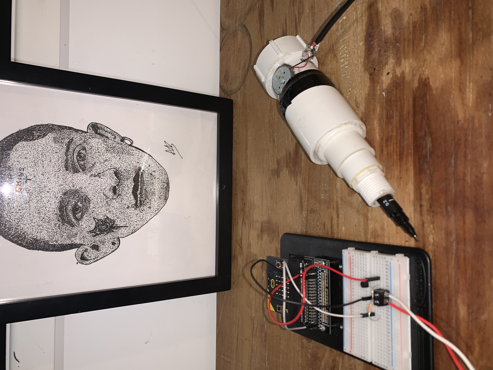
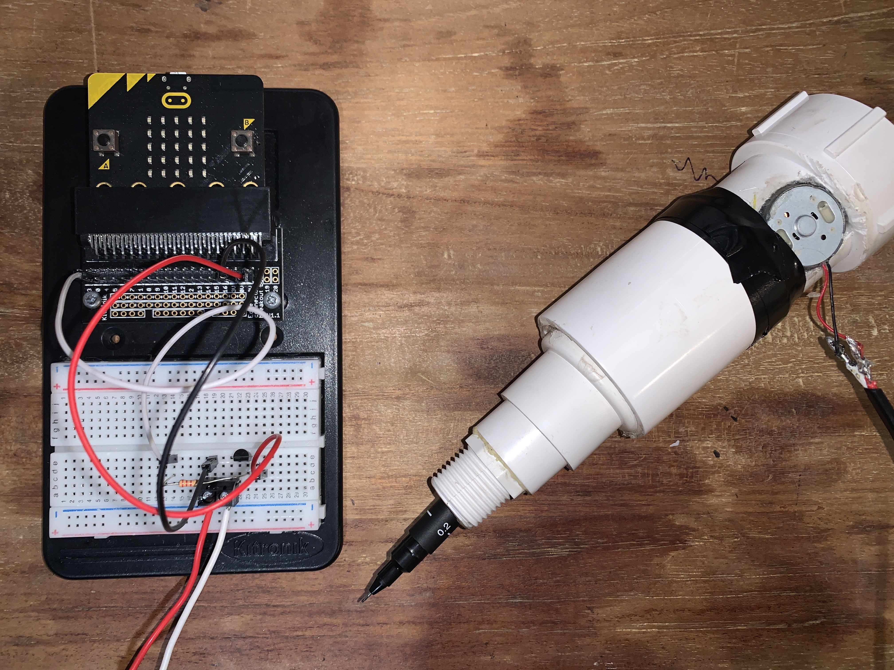
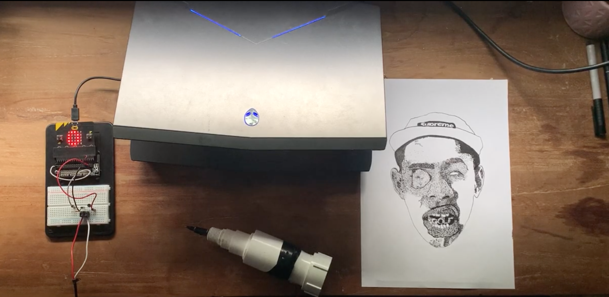

# *Dot-worker*
## *Matt Surman* ##
## 1701QCA Making Interaction 2020 Final Project ##

*The Dot-worker is a drawing machine designed to help artists who choose to stipple or use dot-work in their pieces, it works similarly to a rotarty tattoo machine. The pen is driven up and down by a cam shaft and motor system allowing for the pen to create dots at a faster rate than dotting by hand. The project was mainly designed for myself as a way to complete artworks in a faster fashion.*

### Journal ###

[Process and reflection journal](/journal/journal.md)
