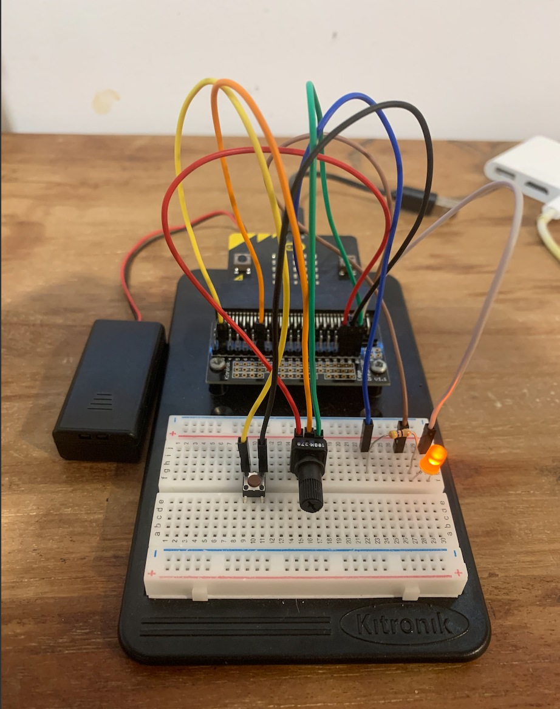
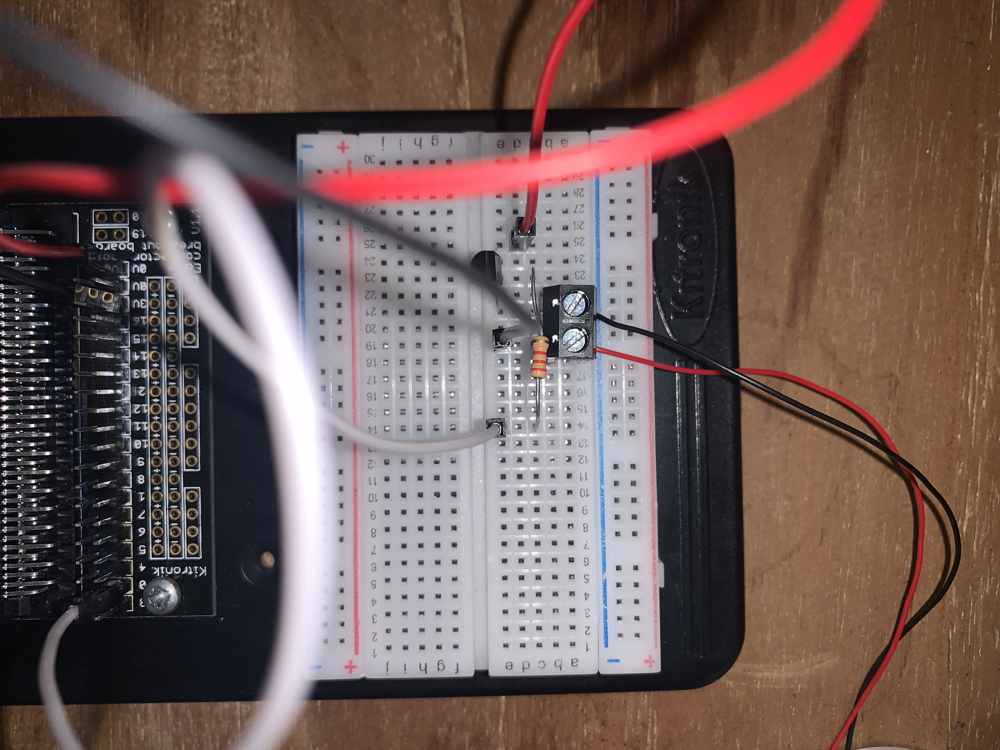

# 1701QCA Final project journal: *Matt Surman: S5186861*

<!--- As for other assessments, fill out the following journal sections with information relevant to your project. --->

<!--- Markdown reference: https://guides.github.com/features/mastering-markdown/ --->

### Related project 1 ###
Geometric Drawing Mahcine

*https://www.youtube.com/watch?v=xp7MkqE4xIw*

*This project is related to mine because it shows off the basic idea of a drawing machine. The project uses similar technology to what I am planning on using for my final piece with the cogs playing a major roll in how the machine runs. This very basic and easy to build geometric drawing machine works by having two arms connected to the turning cogs moving the pen in a circular motion in doing so creating mesmerizing geometric patterns. Looking into machines like this it allowed for me to find a basic level of the technology required in order to create a project like this. With my machine however, I will have to model it more after a legitimate tattoo machine rather than a drawing machine like this. The concept as well as the technology sometimes crosses over between the two allowing me to use aspects of both.*

### Related project 2 ###
Vibration Motor Drawing Machine

*https://www.youtube.com/watch?v=xp7MkqE4xIw*

*This machine is a DIY drawing machine that utilises a vibration motor, battery pack and pens. The machine is designed with the pens arranged together facing outwards and the motor in the middle between them all. As the motor runs the pens are shaken and moved around causing patterns and lines to be drawn on whatever surface the machine is placed on. Again, this is a very simple drawing machine but the technology used is similar to that I plan on using in my own project. By seeing how the motor could be used to move the pens in this manner, it made me think whether I could design something similar to this with the pen being driven up and down casuing the dotted effect rather than having the pens move side to side creating lines. By designing the project to be similar to this one in would eliminate the need for a cog and cam shaft driving the pen up and down but in doing so would make the project more simple and basic. Maybe there is a happy medium between the two ideas that I can begin to look into such as purchasing and testing out one of these vibration motors and testing with and without the cam shaft. Making this project I want to design it as similar to a tattoo machine as possible. In doing so not only can it be used as a drawing machine but could also be refined and produced as a machine for an apprentice to use to produce work with as practice for tattooing. I feel that the vibration motor would come in handy when trying to create a machine similar to a regular rotary tattoo machine.*

### Related project 3 ###
Drill Drawing Machine 

*https://kash1985.wordpress.com/2008/10/16/rough-drawing-machine-ideas/*

*When researching different drawing machines I came across this piece which at frist was simply included because I found it quite funny and while yes it was a drawing machine it seemed like quite a joke however, the more I began to think about it the technology could actuallly be used in one way or another. The basic idea behind the piece is that a ball with pens, pencils or ink is connected to a drill and when the drill is turned on and put against a canvas the drill moves the ball creating different outcomes of lines and in term creating "art". In all honesty, the idea is pretty cool and something I had never really thought about using but the idea would work quite well if you were completing work on a larger scale and needing an automated way of doing so. If there was a way to utilise the technology of a drill to drive a pen in a back and fourth motion I could consider using this in my project however, the issues I would have in doing so would be the sheer size and power of the drill. I think that this would end up becomming a big issue for me in the future. The idea is still something I find intersting and would like to play with more in future I just think the power and size would take away from the project.*

### Related project 4 ###
Simple Tatttoo Machine

*https://www.instagram.com/p/B-cgX_soyzV/*

*These next few projects started getting me very excited. Seeing that people have played with ideas like this as well as exploring the world of these simple build tattoo machines is something that I find extremely interesting. This project was sent to me by my tattoo artist after we had a night of painting together and I had explained to him what I was currently working on at uni. The instagram page is a collection of tattoo machines built by this artist. Each machine is built from everyday materails such as hollowed out pens etc. This was like a wave of ideas after seeing this, and was actually the reason I had the idea for building my machine the way I intend to build it for the final. For example, the hollowed out pen makes for a great housing unit for a smaller pen to be used and can be swapped out for different colours or sizes. The technology used for these machines can be made or bought quite easily too making it easy for me to build. The only big difference between this machine and something I can make would be the motor size and the quality of the cam shaft/cog system. By using the Microbit it limits the power of the motor that can be used which is a shame but still allows me to create a working machine, it just won't be as powerful as those shown by this artist.*

### Related project 5 ###
Dotworker

https://www.instagram.com/p/B-uWJMbC-t-/

*This project is by far both my favourite and the most useful for me when designing the project. Here you can pretty much see exaclty what I am aiming to build. The project shows off this idea I've been toying with perfectly, a machine that can be used for creating dotwork projects similar to producing a tattoo. The technology used is pretty much the same as what I am trying to achieve (Although mine is much less professional). I just found this project to be everything I wanted to produce and it gave me a very well thought out, clean version of the conceptual idea I had been playing with ove the past few weeks. Surprisingly, this is the only fully developed project I found that was pretty much exactly what I was wanting to produce. In seeing this I have realsied this is a very niche market for the project I am wanting to produce, this has both good and bad qualities to it. On the plus side if the product were to go to market there would be no real competition. Then on the downside there is no telling how big or small the market for such a product is.*

### Related project 6 ###
Pen Style Tattoo Machine

*https://www.youtube.com/watch?v=H3Q8sdJDMog*

*The final project I have chosen to include is a modern tattoo machine that is modelled after a pen to be lightweight and comfortable for the user. The design of this piece is the aspect that I had taken in the most, it's very clean and lightweight while still looking professional. In a perfect world I would have loved to create a model based upon this machine to 3D print for my project however, with the current times that just isn't possible. In saying this though I would like to produce something as similar to this machine as possible to keep the look of a tattoo machine, a lot of the drawing machines I have shown previously are modelled off of old school coil machines. They all look very heavy and would be painful to use over an extended period of time, but if they were to be modelled like this machine with a very light material for its casing it would feel no different to holding a larger marker.*

## Other research ##

*T³: 3D Printing a Rotary Tattoo Machine:*

*https://www.sparkfun.com/news/2165*

*This source was a fun blog post showing how you could use a 3D printer to develop a very basic tattoo machine. I had come across this page within the first few weeks of researching this concept and was amazed that you could do such a thing, giving me the idea to 3D print elements of my project. While we may not be able to 3D print due to this current situation I still have taken elements from this source that can be used within my own project such as the build itself. The source details how to build the machine itself with each part being shown in the video, a lot of these ideas I have played with and want to use with my final piece to make sure it works in a similar way to these 3D printed machines*

*How to make your own tattoo machine:*

*https://www.vice.com/en_au/article/zmgz9x/heres-how-to-make-your-own-tattoo-machine*

*This Vice article details the many different ways you could build a DIY tattoo machine talking about the base aspects that need to be build and how you can produce these with vary simple household tools. Funnily enough, most of the machine's built within the piece could all be accomplished with things I have laying around the house. This article to me was a great way of coming up with designs of how this project was going to look, since we don't have access to a lot of the more professional equipment supplied by the university I have turned to going with the more personally built look. The machine is something produced for me and while I do want it to look clean and not as though it will fall apart within a few minutes I do want it to keep that homemade feel to it like some of the machines shown within this piece. It's honestly surprising how informative this was for me detailing each and every aspect that was needed and allowing me to come up with a very simple but effective design draft.*

*How to setup a tatoo machine:*

*https://www.youtube.com/watch?v=2WhIYi9d_yw*

*This is a basic instructional video on how to setup a tattoo machine. I've icluded this source as it showed how a machine should be setup and how I should be designing my project, by modelling the project as a legitimate machine it makes it as interactive as posible. The video also shows all the elements of a tatoo machine that I would like to try and replicate in my drawing machine, as hard as it may be to create some of these I would like to make it as close as possible to a tattoo machine.*

*History of Mechanical Design and Machine Drawing in the School of AMME
*By Andrei Lozzi*

*http://web.aeromech.usyd.edu.au/history-chapters/C6%20Design.pdf*

*This research paper goes through a wide variety of designs in terms of drawing machines throughout history. Dating back to the pre 1950's as well as describing how far we have comes in terms of those machines that we see on a daily basis. This source was an interesting way to see a wide variety of different designs for drawing machines that I coule potentially borrow elements from to design my own interactive project. It's also just amazing to see how far we have come in terms of both design and the art world, something I had never really considered up until this point. One of the biggest things mentioned is the development of CAD software and what this has done for the design world. Having never used or really thought of programs such as these prior to this year I find it incredibly interesting to delve deeper into that world of design. This relates to my project as I am currently designing a 3D models in Fusion360 and this could be used to print parts for my final project.*

*TATTOO MACHINE , THE EVOLUTION BEHIND THE HARDWARE*
*By Tattoo Buddha*

*https://medium.com/@TattooBuddha/tattoo-machine-the-evolution-behind-the-hardware-b09a6bf26ec9*

*I came across this article when research the history of tattoo machine's design wanting to find where the biggest changes occured as well as taking in information on the elements that each iteration contained and seeing if anything could be replicated with my small array of reseources. The most interesting thing I found from this article was just how long the rotrary machine took to become a thing in the tattoo world. It actually amazed me that coil machines were in rotation from eaerly 1920's to 1978 when the frist rotary was deisgned and began to be sold. A magnetic coil machine is the first and classic machine which uses an alternating electromagnetic current to pass through coils and turn magnets on and off in rapid succession. This pulls a spring loaded armature bar and creates an up and down motion, which results in the armature bar tapping the needles into the skin. Whereas, the rotary machine is a small spinning motor attached to an armature, which produces an up and down motion. Rotary machines are much quieter than coil machines and are known to move the needles more smoothly and evenly in comparison to coil. While I do love coil machines and would choose one over rotary any day, it would be far to difficult to replicate with my knowledge so I was more inclined to go in the direction of a rotary design.*

*Laser Stippling*

*https://www.laserstar.net/en/laserstar-tv/stippling-handgun-grips-with-a-laser-how-to-stipple-your-gun.html*

*This source doesn't exactly have much correlation with my project however, I found it incredibly cool. I came across this site when researching machines for stippling to see whether or not anyone had built anything similar to what I was wanting to build. I came across this site which uses a laser engraving machine to stipple designs onto handguns. The technology behind this is amazing and would potentially be able to be used to produce my portraits on a sheet of plastic or other various materials that can be laser cut. Just something cool I found.*

## Conceptual development ##

### Design intent ###
*Design intent: To create a drawing machine that can be used by artists to both produce and speed up the process of making art.*

### Design ideation ###

### Design concept 1 ###
* A pen/ink dropper connected to the micobit's servo motor that can spin the ink into patterns. Similar to the geometric drawing machines outlined earlier. You could use the same arm system as these with the servo motor driving cogs and moving the arms holding pens/ink to create the patterns* 

### Design concept 2 ###
*A wheeled robot that can move a pen around a canvas drawing lines as it moves along creating large scaled artworks. This is based upon the drawing robot shown on the microbit website. The basic idea is that a microbit is coded to move in certain patterns and a pen is attached via a piece of cardboard and wheeles. This idea can be played with endlessly with the microbit being coded to do all kinds of different things.*

### Final design concept ###
### Final design concept ###
* A drawing tool emulating a tattoo machine using pens/pencils instead of needles and ink, to produce stippled work in a much easier way.*
*What problem do you want to solve?*

*The problem I aim to solve with this drawing machine is the sheer time it takes to complete a piece of artwork by stippling or using dot work. Stippling is very much like traditional tattoo methods such as Tebori, where the artist will need to dot each piece by hand. Similar to how a tattoo machine made this easier for artists to tattoo, I would like to make a mchine for dotwork artists to not have to produce every dot by hand individually and speed up the process.*

*What relation do you want to form or change? What experience do you want to create?*

*The expierence I want to create is a feeling of joy for artists I know that if a machine like this already existed I would use it every day, there is something so time consuming about producing stippled work that will often stop me from finishing pieces.*

*What kinds of people will be involved in this scenario? What non-human actors/participants? What is the future scenario you imagine?*

*Artists would be the main target audience, the scenario I imagine is that this machine could be something for artists to use at their own will for speeding up the process of their art.*

*What are the start and endpoints of your path?*

*The start point of this project is the design ideation and sketching. From here it is a matter of testing and prototyping the idea and coming to a final usable result by the endpoint*

### Interaction flowchart ###

*Here you can see the interaction flowchart for the pen tattoo machine. At first final piece was going to require the user to turn the potentiometer to ajust the speed the machine runs at. The idea was that this will then turn the motor on and ajust it's speed therefore ajusting the speed at which the worm drive is connecting with the cog and cam shaft pushing the pen up and down.*

*After many experiments which will be detailed below I found this idea to be quite painful and not too useful in all honesty and after a few conversations with Jayden about what I could do I came to using PWM, or pulse-width modulation. It’s a way of controlling the speed (or brightness) of devices. This would work much better in the situation I was trying to achieve as controlling a motor like that directly with a potentiometer is not ideal, seeing it will stop turning under a certain voltage, whereas PWM maintains the voltage but simply powers it for fractions of a second. With this in mind I developed a new and more refined interaction flowchart.*

## Process documentation ##

*After reaserching the project in depth I had a general idea of what I wanted to begin completing. The first stage of the process would be getting all the neccessary equipment this included; Buying the wormdrive, cogs, and pvc piping for the housing unit. I had already begun to encounter issues trying to find the correct sizes for all the elements I had to be ussing in order for the project to work such as the cogs and pvc pipe however, in the end I founnd sizes that would work. Once I had found the correct sizes and had all the elements back home it was time to start building and playing around. The first step for me was laying out all my elements on the table and figuring out just how I wanted it to be layed out. I arranged the pvc piping into the descending order making the larger outer housing unit for the whole project and fitted the motor and worm drive to the top, that way it was in a fixed position and I had one part completed already. The next step was melting down and sanding a few of the pieces of pipe in order to create a snug fit that wouldn't fall apart when picked up by the user. If this were to happen the whole unit would fall apart whereas on the other hand if it were all glued together it would be a one time use project and you couldn't easily maintenance it. Once this had been achieved I wanted to begin working on the pen's housing unit. At the start I had no real idea how I was going to do this to be honest becasue it would need to fit the pen in such a way that it wouldn't just fall out but at the same time wouldn't be giant and make the project bulky. I ended up cutting the top off of a 4 colour multipen for the top of the housing unit and hollowing out a black sharpie for the base with both units combined the pen fits snug between and also has enough room to be moved up and down by the cam shaft. Finally, I have wired up the motor on the breadboard and Microbit and have it working with the worm drive.*

*The next step I wanted to work on was getting my circuit setup and this ended up being much harder than I had initially thought it would be and ended up being my biggest setback. My idea of using a potentiometer soon became a bit of a nightmare. The first thing I did was recreate the experiement using a potentiometer to turn an LED up and down. This was simple enough as I was simply following the kitronic tutorial but once I had completed this I really had no idea how I was going to include the DC motor that would be used to run the dotworker machine. I tried to research for hours coming up with nothing as nothing online showed a circuit using a DC motor with a potentiometer with a Microbit. I was so lost and confused I decided to email Jayden and ask for some help in regard to the circuit and how to go about things. He soon came back to me explaining that the idea of using a potentiometer for a motor wasn't the brightest as using it will stop turning under a certain voltage. He told me to start some research into PWM and how I could try and achieve this.

*This was the attempt at making the experiment using the potentiometer and while it worked at adjusting the LED's light levels that was about all it was good for. It was a good way of getting to use the microbit more though so I am thankful for this but it was just a stepping stone for the final product. I began to look more into PWM or pulse-width modulation. From what I found and Jayden explained it was a common way of controlling the speed (or brightness) of devices. For this project it would work much easier than a potentiometer and it would just be a matter of incorporating it.*

*My research brought me to a few instances of microbit code including PWM and allowed me to start building my own. The general idea behind most was that buttons on the Microbit would increase or decrease the speed incrementally so I started to replicate something similar in my own code. Below you'll be able to see what I ended up creating.*

*The code would work in theory and it was time to setup a circuit with the DC motor on the Microbit. This is where I encountered a few more issues. I setup my motor as it was shown in experiment 4 and the motor began to spin. I thought I had success so I downloaded my code and then tried it out. Nothing. The motor just continued to run even with the buttons being pressed. I was lost and kept going over and over re-making the circuit as I just had it. I knew it was something to do with my circuit as the code was perfect and working on the Microbit. Below you can see the circuit I was running over and over again. Note that the wire connected to ground had been unplugged to stop the motor constantly running as it began to get a tad bit annoying after an extended period of time.*

*After playing around with the circuit more and more. I chose to reach out to Jayden once more and see if he had any idea where I was going wrong. Luckily, he was quick to respond in pointing out what I had been missing in my hours of staring at the same circuit. The leg of the resistor needed to be in the same column (the numbered lines) and not in the same row (the lettered lines). Secondly, the the transistor was wired up incorrectly. So the motor was running but it wasn't connected to the microbit and running the code it was supposed to be running.*

*Once this had been mofified the circuit began to run according to plan and the microbit's A and B buttons could be used to adjust the speed in which the motor was running. This was hoestly, one of the happiest moments of the week for me I was jsut so happy to see that this project was really starting to come together. Now I would just need to finish off connecting each of the elements the housing unit was made of as well as ensuring that the camshaft was in place and allowed for the machine's motor to drive the pen up and down.*

## Final code ##

<!--- Include here screenshots of the final code you used in the project if it is done with block coding. If you have used javascript, micropython, C, or other code, include it as text formatted as code using a series of three backticks ` before and after the code block. See https://guides.github.com/features/mastering-markdown/ for more information about that formatting. --->

## Design process discussion ##
*The design process was one of the easier parts of the project as I was modelling the deisgn of something that already existed. As my earlier research showed there is a wide variety of prison style machines out there to chose from and most of these designs were direct influences for my final project.*

*These inital sketches showed off exactly what I wanted for the deisgn and this was still at a stage when we had access to the 3D printer and laser cutter so I was expecting to use these to print and deisgn parts for the project however, that soon became something that couldn't be used sadly. With the uni shut down I looked for parts I could use in a similar vain to keep the project together and what I came to was hollowed out pens, PVC pipe and spare metal parts. The project was no longer something pretty, sleek and clean but it was going to work. I glued the DC motor into the largerst piece of PVC pipe that would be the housing unit for both it and the connecting cog and camshaft. This was easy enough and worked fine. The next step was to hollow out a pen for the housing of a smaller more sleek pen that I often use for drawing. This was done with a large saw as well as a lighter and sanding the edges to clean them up. The pen housed the smaller pen perfectly so this was another success for me. Finally I had to melt down one of the PVC pieces of pipe in order for it to connect with the others this was quite the easy task and was done in a similar manner to the pen and the next step would just be combining all the elements together.*

*From these photos you can begin to see the overall form coming together with each element put together such as the pen housing unit and the overall pipe housing. At this point I know the project isn't too pretty but thats not something I'll be taking into consideration in order to get this project finished. This project is purely for my own use at this point and so functionally is the key element of design in my mind. I don't really care about the fact that the piece looks ghetto and like a prisoner could have built it, it gives character in my eyes. However I did choose to design a final piece on how I would have loved the project to look in illustrator. This final asset shows a clean sleek black silhouette of a body the machine could have had 3D printed. I am actually working on the design for a print in my 3D Modelling course so this is a project I can keep working on as my knowledge grows between courses.*

*From this design you can see how I would have loved the design to be by the final. Taking a lot of infleuence from the design of a standard tattoo machine, by modelling it as such it would be a comfortable and light machine to be used for long periods of time. But as I said this is still a possibility in the future to produce something much like this. I think the limitation of the Microbit is also a pain in regard to the project. Potentially after the course is over I can build a proper machine for using in my everyday life that doen't require the motor to be wired to the microbit and can use a battery pack.*

## Reflection ##

<!--- Describe the parts of your project you felt were most successful and the parts that could have done with improvement, whether in terms of outcome, process, or understanding.

What techniques, approaches, skills, or information did you find useful from other sources (such as the related projects you identified earlier)?

What parts of your project do you feel are novel. This is IMPORTANT to help justify a key component of the assessment rubric.

What might be an interesting extension of this project? In what other contexts might this project be used? --->
